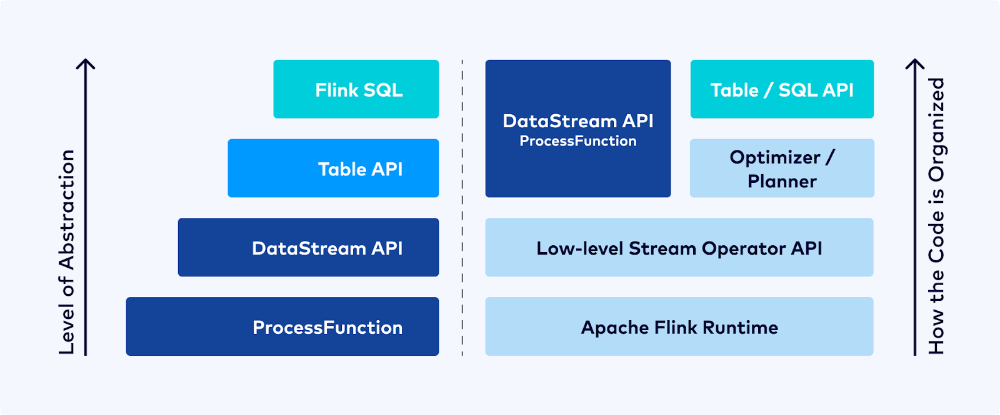

### Intro
`AI모델`에 필요한 학습데이터를 만들기 위해서 `Kubeflow Pipeline`으로 작업을 했었습니다.
`Object Stroage`나 `Hadoop`에서 일별로 `RawData`를 가져와서 loop 안에서 데이터를 정제하는 과정을 거쳤었는데
의도치 않게 예외가 발생하거나 버그가 있는 경우에는 처음부터 다시 재처리해야 했었습니다.
`RawData`가 일별 데이터가 아니라 월별 혹은 년 단위와 같이 데이터가 큰 경우에는 더 많은 시간이 걸렸었죠.
# 
이때 스트리밍 데이터 처리가 필요하다는 점을 많이 공감했고
`Spark Streams`, `Kafka Streams`, `Flink` 등 여러 스트리밍 기술 중에서 `Flink`가 관심이 많이 갔습니다.
핑크 다람쥐가 귀엽기도 했고 `Micro Batch`가 아닌 `Native Streamming`을 지향하는 스트리밍 기술이기 때문에
다른 분산 스트리밍 데이터 처리 엔진보다 발전된 형태라고 판단했습니다.
#
`AWS`, `Ebay`, `삼성 SDS`, `SKT`와 같은 IT대기업에서도 `Flink`를 많이 사용하고 있는 것을 찾아볼 수 있습니다.
`Alibaba`에서는 `Blink`라는 이름으로 `Branch`를 별도로 운영할 정도로 주요 역량으로 생각하고 있는 듯 합니다.

### Data Streaming Application 
`데이터 스트리밍처리`란 `배치처리` 와 달리 완료 시점이 없습니다.
그래서 `배처처리`와 같이 데이터의 처음부터 마지막까지 처리한 후 최종 결과물을 만들 수 없습니다. 
그러므로 지속적으로 유입되는 데이터를 처리하고 그 때마다 결과물을 기록해야합니다.
# 
`애플리케이션`은 시스템의 상태에 따라 `메모리`가 부족하여 비정상적으로 종료되기도 하며 
잘 짜여진 코드더라도 예상치 못한 버그가 있을 수 있습니다. 
만약 한 달 동안 데이터를 처리하다가 갑자기 애플리케이션이 종료되면 어떻게 될까요?
처음부터 다시 데이터 처리를 해야한다면.. 생각만 해도 끔찍할 것 같습니다. 
더욱이 중간에 또 종료되지 않을 것이라고 보장하지 못합니다.
그러므로 짧은 `지연타임`으로 `스트리밍 애플리케이션`이 처리한 데이터 상태를 저장하고 관리해야합니다.
그리고 `종료`된 시점부터 다시 애플리케이션이 동작해야 합니다.

#
`멱등성`이라는 단어가 있습니다. 수학에서 유래한 용어로 `연산`을 여러 번 적용하더라도 결과가 달라지지 않는 성질을 뜻합니다.
데이터를 여러 번 처리했을 때 그 결과가 동일하다면 큰 문제는 없습니다.
하지만 처리할 때마다 결과값이 다르고 데이터를 여러번 처리하지 못하는 상황이라면 어떨까요?  
# 
우리는 `데이터 스트리밍 애플리케이션`이 데이터를 한 번만 처리할 것이라는 예상하지만 데이터는 여러 번 처리될 수도 있습니다.
예를들어 `정전`과 같이 예상하지 못하게 종료되었고 다행히 종료되기 전 백업한 상태가 있어 다시 애플리케이션을 구동할 수 있습니다.
하지만 백업된 상태가 종료 전에 처리 중인 데이터 시점으로 복원될 것으로 보장할 순 없습니다.  
그러므로 경우에 따라서 데이터를 다시 처리해야할 것입니다. 
이 때 저장된 상태 즉 DB에는 이미 처리된 데이터의 상태를 갖고 있다면 우리가 예상치 못한 문제가 발생할 수 있습니다.
그러므로 `데이터 스트리미밍 애플리케이션`은 데이터가 중복처리 없이 `Exactly Once`처리되도록 보장해야합니다. 
#
이렇게 `스트리밍 애플리케이션`을 다루다 보면 `배치처리`와 달리 해결해야할 과제들이 많습니다.
`Apach Flink`는 위 문제점들을 효과적으로 해결하고 높은 처리 성능으로 데이터를 스트리밍 처리할 수 있는 
다양한 기능들을 제공합니다. 

### Into the Apach Flink
`Apach Flink`는 대규모 데이터 스트리밍 처리를 위한 오픈 소스 `분산 스트리밍 데이터 처리엔진`입니다.
`Flink`는 `3세대` 스트리밍 처리 엔진으로 `2세대` 스트리밍 엔진인 `Apache Spark Streaming`과 달리 
`Micro-Batch`가 아닌 `Native Streaming`으로 데이터를 처리합니다. 그러므로 높은 처리 성능을 제공합니다.
# 
`Flink`는 `실시간 데이터 스트리밍`뿐만 아니라 `배치 처리`도 지원합니다.
`배치 처리`를 스트리밍 처리의 한 가지로 종류로 생각하고 처리할 수 있습니다.
또한 데이터의 상태를 관리하기 위해 로컬에 저장하여 처리 지연을 최소화하면서 
`상태 백엔드(Memory / RocksDB)`를 통해 상태의 일관성을 유지합니다.
그리고 데이터가 `Exactly-once` 정확하게 한 번만 처리되도록 `체크포인트`와 `세이브 포인트`와 같은 스냅샷을 제공합니다.
#
`Flink`는 `이벤트 시간(Event Time)`과 `처리 시간(Process Time)`을 모두 지원하여 `이벤트 시간`기준으로 `윈도우 연산`이 가능합니다.
네트워크 때문에 데이터가 발생한 시간 순서에 따라서 처리되지 못하는 경우가 있습니다.
예를들어 게임 속에서 여러 플레이어가 보스를 사냥을 하는데 갑자기 터널 안으로 들어가서 
네트워크가 잠깐 유실되는 동안 다른 플레이어의 데이터가 서버에 먼저 도착할 수 있습니다.
이러한 경우 `처리 시간`을 기준으로 데이터를 처리한다면 우리가 생각하는 인류의 법칙이 적용되지 않을 것 입니다.
`이벤트 시간`을 기준으로 한다면 정상적으로 처리가 되겠죠. 물론 `지연 데이터 처리`는 다른 이슈이긴 합니다.
#
`Flink`는 `Flink Connect`, `Flink CDC`를 통해서 다양한 Source와 Sink를 연결합니다.
`Flink CDC`는 내부적으로 `Kafka`를 사용하여 Offset을 관리합니다. 
Source로 유입되는 데이터 및 변경사항을 캡처하여 실시간으로 데이터를 처리할 수 있습니다.
그리고 `Hadoop`, `NoSql`, `Socket`, `File`, `Mysql` 등 다양한 `Database`에 처리된 데이터를 Sink로 저장할 수 있습니다.
#

`Flink`는 이미지와 같이 다양한 계층의 API를 제공하여 데이터를 효율적으로 처리할 수 있도록 합니다.
`ProcessFunction` 을 통해서 `타이머`, `상태관리`를 조작하는 등의 `Flink`에서 저수준의 프로그래밍을 지원합니다.
`DataStream API`는 저수준의 프로그래밍 API를 제공하여 
`Multi Source / Multi Sink`, `BroadCasting`, `CheckPoint` 등을 조작하는 등 복잡한 데이터 처리 로직을 구현할 수 있습니다. 
`Table & SQL API`는 선언적 SQL 쿼리를 통해 고수준의 계층에서 데이터를 쉽게 처리할 수 있습니다. 
친숙한 `SQL`을 사용하여 `Source`와 `Sink`를 정의하고 데이터 처리는 `Where`, `GroupBy`와 같은 형태로 선언할 수 있습니다.
이러한 `Table & SQL API`는 `Flink`에서 `Job Grpah`로 변환된 후 `물리 그래프`로 변환되어 분산 서버에서 데이터가 처리됩니다.
#

### Outro
`Flink`에 녹아있는 기술들을 정리하고 이해하려고 합니다. 그리고 머지 않아 `Flink` 오픈소스 커밋터로 활동하기를 기대합니다.
부족한 내용이나 고쳐야하는 부분이 있으면 피드백 주세요.
