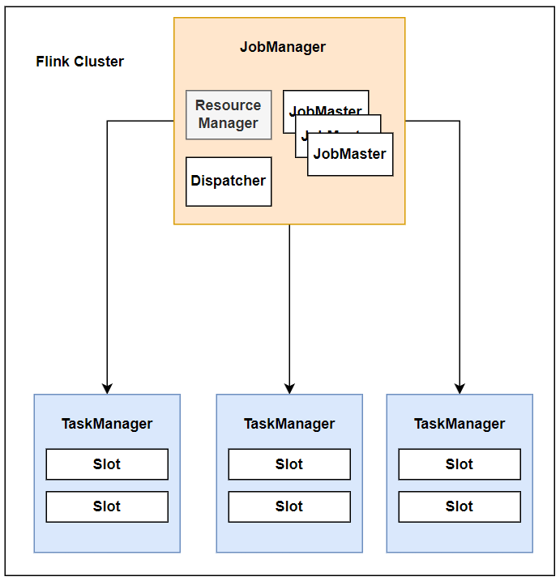
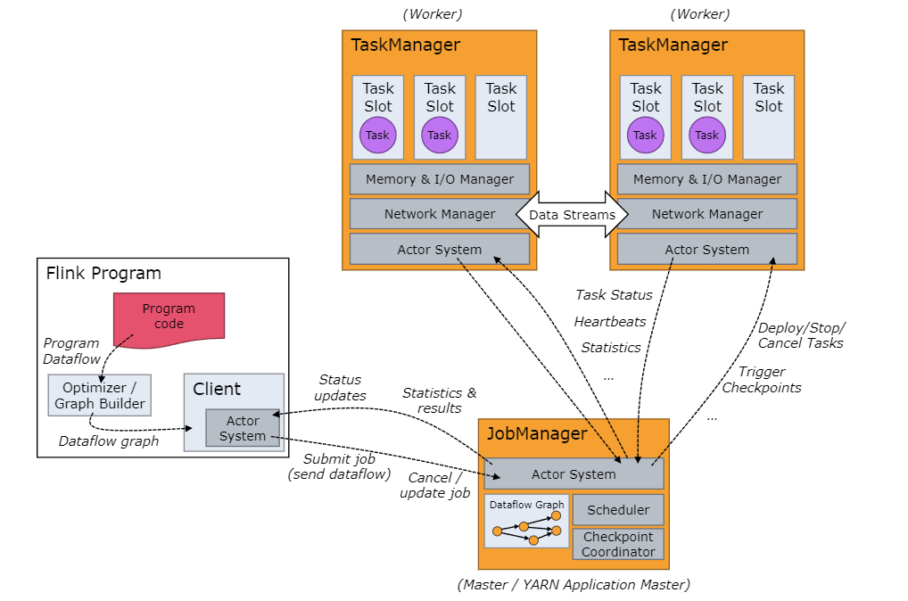
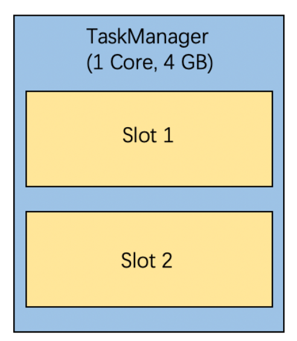

### Intro
`Apach Flink`는 대규모 데이터 스트리밍 처리를 위한 오픈 소스 `분산 스트리밍 데이터 처리엔진`입니다.
`Apach Flink`는 대규모 데이터를 여러 서버에 분산하여 처리하기 때문에 
각 서버의 리소스를 관리해야하며 안정적이고 신뢰성있게 데이터를 처리하기 위해서 장애상황을 생각하고 고가용성을 갖춰야 합니다.
이러한 요구사항은 분산 처리 시스템이 기본적으로 갖춰야 할 사양입니다.
#
`Flink`는 `JobManager`, `TaskManager`의 `Master`-`Worker`구조로 `Flink` 클러스터를 구성합니다.
`JobManager`는 `Flink`의 마스터 프로세스로서 `Flink Application`을 안정적으로 실행해야할 의무를 갖습니다. 
`TaskManager`는 `JobManager`로 부터 할당받은 `Task`를 실행해야합니다.
# 
`Flink`는 `JobManager`와 `TaskManager`가 분산 처리 시스템의 요구사항을 만족하기 위해서 
`Apache Mesos`, `Apache Hadoop Yarn` 또는 `Kubernetes`와 같은 클러스터 인프라를 이용합니다. 
물론 `StandAlone`을 제공하여 `로컬 클러스터`를 구성하여 테스트 환경을 구축할 수 있습니다.
또한 `Apache Zookeeper`를 통해 `JobManager`를 이중화하여 고가용성을 제공합니다.

### JobManager

`JobManager`는 `Flink`의 마스터 프로세스로 `Flink Application`들을 안정적으로 운영하기 위해 다양한 작업을 담당합니다. 
주요 역할로는 `Task Scheduling`, `Resource Monitoring`, `CheckPointing` 등이 있습니다. 
이러한 작업은 `JobManager`의 여러 컴포넌트로 세분화되어 수행됩니다.

`JobManager`는 다음과 같은 주요 컴포넌트로 구성되어 있습니다:

- **ResourceManager**: 클러스터의 리소스를 관리합니다. 여기서 리소스는 Memory, CPU와 같은 하드웨어 리소스를 말하며 리소스는 `TaskManager`의 `Slot`으로 구분되어 있습니다.
- **Dispatcher**: 사용자로 부터 `Flink Application` 를 받는 `REST API`를 제공합니다. 그리고 `JobMaster`를 생성합니다.
- **JobMaster**: `Flink Application`마다 1개씩 생성되며 작업의 실행을 관리하며 작업 상태를 모니터링하고 체크포인트를 처리합니다.

# 

`JobManager`는 사용자가 제출한 `Flink Application`을 수신합니다. 
`Flink Application`은 `JobGraph`라고 불리는 논리 데이터플로우 그래프와  애플리케이션에 필요한 클래스, 라이브러리를 포함한 JAR파일로 구성되어 있습니다.
`JobManager`는 `JobGraph`를 `실행그래프(ExecutionGraph)`라고 부르는 물리 데이터플로우 그래프로 변환합니다.
그리고 `JobManager`는 `ResourceManager`에게 `ExecutionGraph`를 실행에 필요한 자원(태스크 매니저 슬롯)을 요청합니다.
`ExecutionGraph`를 실행할 수 있는 충분한 태스크 슬롯을 할당받으면 `JobManager`는 `TaskManager`로 `ExecutionGraph`를 배포합니다.
#
`JobManager`는 `ExecutionGraph`를 배포한 후 작업들이 `Task Slot`에서 정상적으로 잘 작동하는지 모니터링합니다.
또한 데이터 흐름을 조정하고 작업 간의 데이터 파티셔닝과 재분배를 관리합니다.
작업이 완료되면 자원을 해제하고 결과를 수집한 후 저장합니다.

### TaskManagers
`TaskManager`는 `Flink`의 워커 프로세스입니다. 
`TaskManager`는 작업을 실행하기 리소스를 슬롯의 형태로 관리합니다. 
일반적으로 `TaskManager`는 여러개의 슬롯을 갖고 있습니다.

`TaskManager`는 실행될 때 자신이 갖고 있는 슬롯을 `ResourceManager`에 등록합니다.
`ResourceManager`로 부터 슬롯이 필요하다는 요청이 오면 
`TaskManager`는 유후상태인 슬롯을 `JobManager`에게 제공합니다.
`JobManager`는 `ExecutionGraph`를 해당 슬롯에 할당합니다. 
# 
`TaskManager`는 여러개의 슬롯을 갖고 있으며 Slot마다 Task를 실행할수 있습니다.
`TaskManager`는 `JVM`애플리케이션이므로 `Task`를 실행하기 위해서 `Thread`를 사용합니다.
그러므로 만약 하나의 `Thread`에서 에러가 발생한 경우 `TaskManager`애플리케이션이 비정상적으로 종료가 될 위험이 있습니다.
그러므로 하나의 서버에 `Slot`한 개의 여러 개의 `TaskManager`를 실행하는 것이 안전성을 높이는 방법일 수 있습니다.

### Outro
간단하게 Flink의 Architecture를 살펴보았습니다.
추후에 내용을 조금 더 보완할 필요가 있겠네요.