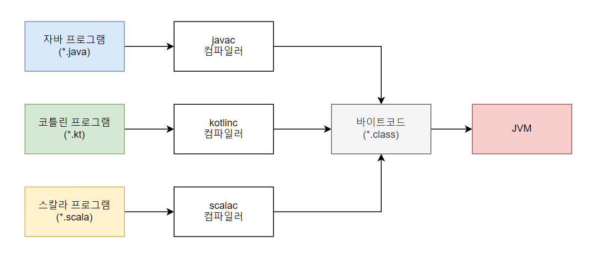

### Intro
`Java Compiler`가 `.java`파일을 컴파일하면 ByteCode를 담은 `.class` 파일이 생성됩니다.
`.class`파일은 `Class Loader`에 의해 해석되며 `JVM 메모리`에 로드되어 실행됩니다.
이러한 `ByteCode` 덕분에 `Java`는 `WORA`(Write Once, Run Anywhere)라는 강력한 특징을 갖게되었습니다.

# 

`ByteCode`에는 또 다른 장점이 있습니다. 
`JVM`(자바 가상 머신)은 초기 설계부터 가상 머신에 다른 언어를 실행할 가능성을 염두에 두었습니다.
그래서 자바 외 다른 언어에서 `ByteCode`로 변환해주는 컴파일러만 있으면 `JVM`에서 실행될 수 있습니다.
오늘날에는 `Java`말고도 `Scala`, `Kotlin`, `Groovy`, `Clojure` 등 다양한 언어가 `JVM`에서 실행됩니다.
그럼 `.class`파일에 있는 `ByteCode`는 무엇이고 어떤 구조로 되어있을까요?

### .class File
`클래스파일`은 바이트를 단위로 하는 이진 스트림 집합체입니다. 
각 항목은 정해진 순서에 맞게 구분 기호 없이 나열되어있습니다.
1바이트가 넘는 데이터 항목은 바이트 단위로 분할되며 빅 엔디언 방식으로 표현됩니다.
그래서 클래스 파일 전체가 낭비되는 공간없이 프로그램을 실행하는데 필요한 데이터로 채워집니다.

```java
ClassFile {
    u4             magic;
    u2             minor_version;
    u2             major_version;
    u2             constant_pool_count;
    cp_info        constant_pool[constant_pool_count-1];
    u2             access_flags;
    u2             this_class;
    u2             super_class;
    u2             interfaces_count;
    u2             interfaces[interfaces_count];
    u2             fields_count;
    field_info     fields[fields_count];
    u2             methods_count;
    method_info    methods[methods_count];
    u2             attributes_count;
    attribute_info attributes[attributes_count];
}
```
`바이트스트림`은 C 언어의 구조체와 비슷한 구조를 표현하며
`부호 없는 숫자`와 `테이블` 두 가지 타입으로 `ClassFile`을 나타냅니다.
`부호 없는 숫자`는 `u1`, `u2`, `u4`, `u8`으로 각각 1바이트, 2바이트, 4바이트, 8바이트를 뜻합니다.
`테이블`타입은 여러 개의 부호 없는 숫자나 또 다른 테이블로 구성된 복합 데이터 타입을 표현합니다. 
관례적으로 테이블 타입은 `_info`으로 표현합니다.
# 
`ClassFile`의 구조는 클래스를 나타내는 메타정보와 속성으로 이루어져있습니다.
`attribute_info` 테이블이 클래스의 다양한 정보를 담고 있는 속성 테이블입니다.
속성 테이블은 `클래스 속성 테이블`, `메소드 속성 테이블`, `필드 속성 테이블`이 있습니다.  
`클래스 속성 테이블`에는 `제네릭 매개 변수화 타입`, `java파일 이름`, `Inner 클래스 정보`가 있습니다.  
`메소드 속성 테이블`에는 해당 `메소드의 코드`가 저장됩니다.  
`필드 속성 테이블`에는 final 키워드로 정의된 `상수값`이 저장됩니다.  
속성 테이블에 대한 내용도 꽤 많은 내용이 있어 우선 클래스의 메타정보를 나타내는 타입을 살펴보겠습니다.
#
**magic number**  
모든 클래스 파일의 처음은 4바이트인 `매직 넘버`로 시작합니다. 
`매직 넘버`는 가상 머신이 허용하는 클래스 파일인지 여부를 확인하는 용도로만 사용됩니다.  
# 
**minor version**  
2바이트로 JDK `마이너 버전`을 표현합니다.
# 
**major version**  
2바이트로 JDK `메이저 버전`을 표현합니다.  
#
**constant_pool_count**  
버전 다음으로는 `상수 풀`을 나타냅니다.
`상수 풀`은 고정적이지 않으므로 상수 풀에 앞서 항목의 개수를 알려주는 2바이트 데이터가 필요합니다.
# 
**constant_pool[constant_pool_count-1]**  
`상수 풀`에는 다양한 `문자열 상수`, `클래스` 및 `인터페이스 완전한 이름`, `필드 이름`과 `서술자`, `메서드 이름`과 `서술자` 등을 나타냅니다.
.class파일에서 대체로 가장 큰 부분을 차지합니다. 
`상수 풀` 안의 상수는 모두 테이블 타입입니다. JDK21 기준으로 총 17가지 상수 타입이 존재합니다.

```java
CONSTANT_Methodref_info {
    u1 tag;
    u2 class_index;
    u2 name_and_type_index;
}
```
위 상수 타입은 클래스 내의 메서드를 나타내는 타입입니다.  
`tag`는 `상수 풀`에서의 `Methodref`가 갖는 태그번호이며 `u2 class_index`는 `메서드`가 정의된 `클래스 정보`,
`u2 name_and_type_index`는 `메서드의 이름`과 `타입` 정보를 타나내는 인덱스 입니다.
#
**access_flags**  
상수 풀 다음의 2바이트는 현재 클래스의 접근 정보를 식별하는 접근 플래그입니다.
`public`인지, `abstract`인지, `final`인지 등의 여부를 나타냅니다.
#
**this_class, super_class, interface_account**  
다음으로는 현재 `클래스의 인덱스`와 `부모 클래스 인덱스`, `인터페이스 인덱스 컬렉션`입니다. 
`인덱스`는 `상수 풀`에 대한 유효한 인덱스로 구성되며 클래스 파일의 상속 관계를 규정합니다.
#
**fields_count**  
`필드 테이블`은 `인터페이스`나 `클래스` 안에 선언된 `변수`들을 나타냅니다. 
`필드 테이블` 또한 고정된 값이 아니므로 필드 테이블을 나타내기 앞서 개수를 알려주는 2바이트가 필요합니다.
# 
**field_info[fields_count-1]**  
필드에 접근할 수 있는 `접근 범위제한자`(public, private, protected), `불변 여부`,`휘발성`,
`직렬화` 시 포함여부, `데이터 타입`, `필드 이름`의 정보를 담고 있습니다.
```java
field_info {
    u2             access_flags;
    u2             name_index;
    u2             descriptor_index;
    u2             attributes_count;
    attribute_info attributes[attributes_count];
}
```
`access_flags`는 해당 필드가 `public`, `private`, `protected`인지 여부를 표현하는 바이트2 자리로 표현합니다.
`name_index`는 필드의 단순 이름을 나타내며 `상수 풀`에서 `CONSTANT_NameAndType` 인덱스를 나타냅니다.
`descriptor_index`는 `필드`의 경우 `데이터 타입`까지, `메서드`의 경우 `매개 변수 목록`(개수, 타입, 순서 포함)과 
`반한값`까지 기술합니다. 
#
**methods_count**  
메소드 테이블의 개수를 나타내는 2바이트입니다.
#
**method_info**  
```java
method_info {
    u2             access_flags;
    u2             name_index;
    u2             descriptor_index;
    u2             attributes_count;
    attribute_info attributes[attributes_count];
}
```
`메소드 테이블`의 구조도 `필드의 테이블`구조와 동일합니다.
`접근 범위제한자`(public, private, protected), `이름 인덱스`, `서술자 인덱스`입니다.
`메서드의 본문(코드)`은 `속성 테이블`에 저장됩니다. 
### ByteViewer
`javap 커맨드`를 통해서 를 통해서 .java 파일의 내용이 .class에서는 어떻게 표현되는지 확인해보겠습니다. 
```java
package org.jovialcode.base;

public class Bytecode {
   private static final String field = "string";

   public static String staticMethod() {
      return "staticMethod";
   }
}
```
`javap -v`는 바이트 코드의 순서대로 출력하는 것이 아니라 클래스의 구조를 더 이해하기 쉽게 정리하여 출력합니다.
위 커맨드는 클래스의 구성 요소를 섹션별로 그룹화하고, 각 요소의 세부 정보를 표시합니다.
```java
 > javap -v -c .\Bytecode.class
Classfile /java/main/org/jovialcode/base/Bytecode.class
  Last modified 2024. 5. 12.; size 444 bytes
  MD5 checksum 241941b8981b9e32e706593708b84fcb
  Compiled from "Bytecode.java"
public class org.jovialcode.base.Bytecode
  minor version: 0 //마이너 버전
  major version: 62 //메이저 버전
  flags: (0x0021) ACC_PUBLIC, ACC_SUPER // 접근 제어자
  this_class: #9 //Bytecode 클래스 인덱스  // org/jovialcode/base/Bytecode
  super_class: #2 //Bytecode가 상속하는 클래스  // java/lang/Object
  interfaces: 0, fields: 1, methods: 2, attributes: 1
Constant pool: //상수풀
   #1 = Methodref          #2.#3          // java/lang/Object."<init>":()V
   #2 = Class              #4             // java/lang/Object
   #3 = NameAndType        #5:#6          // "<init>":()V
   #4 = Utf8               java/lang/Object
   #5 = Utf8               <init>
   #6 = Utf8               ()V
   #7 = String             #8             // staticMethod
   #8 = Utf8               staticMethod
   #9 = Class              #10            // org/jovialcode/base/Bytecode
  #10 = Utf8               org/jovialcode/base/Bytecode
  #11 = Utf8               field
  #12 = Utf8               Ljava/lang/String;
  #13 = Utf8               ConstantValue
  #14 = String             #15            // string
  #15 = Utf8               string
  #16 = Utf8               Code
  #17 = Utf8               LineNumberTable
  #18 = Utf8               LocalVariableTable
  #19 = Utf8               this
  #20 = Utf8               Lorg/jovialcode/base/Bytecode;
  #21 = Utf8               ()Ljava/lang/String;
  #22 = Utf8               SourceFile
  #23 = Utf8               Bytecode.java
{
  public org.jovialcode.base.Bytecode();
    descriptor: ()V //메소드 서술자
    flags: (0x0001) ACC_PUBLIC // 메소드 접근제어자
    Code: //코드
      stack=1, locals=1, args_size=1
         0: aload_0
         1: invokespecial #1                  // Method java/lang/Object."<init>":()V
         4: return
      LineNumberTable:
        line 3: 0
      LocalVariableTable:
        Start  Length  Slot  Name   Signature
            0       5     0  this   Lorg/jovialcode/base/Bytecode;

  public static java.lang.String staticMethod();
    descriptor: ()Ljava/lang/String;
    flags: (0x0009) ACC_PUBLIC, ACC_STATIC
    Code:
      stack=1, locals=0, args_size=0
         0: ldc           #7                  // String staticMethod
         2: areturn
      LineNumberTable:
        line 7: 0
}
SourceFile: "Bytecode.java"
```


### Reference
[오라클 문서](https://docs.oracle.com/javase/specs/jvms/se7/html/jvms-4.html)
JVM 밑바닥까지 파헤치기
