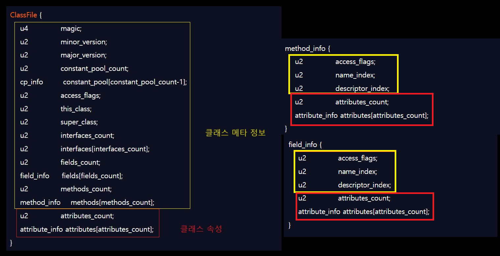

### Intro
[`ClassFile-1`](/blog/java-classfile-1/) 에 이어서 클래스파일의 속성에 대해서 정리합니다.
# 
### ClassFile Attribute

`클래스파일`은 클래스 메타 정보와 속성으로 구성되며
`속성`은 클래스의 메타 정보를 제외한 `final`,`Exceptions`, `SourceFile`, `제네릭 타입`, `Code속성` 등의 클래스를 풍부하게 하는
기능을 나타냅니다. `속성`은 `class_file`, `field_info`, `method_info`,`Code속성` 등에서 목적에 맞게 존재합니다.
#

```java
attribute_info {
    u2 attribute_name_index;
    u4 attribute_length;
    u1 info[attribute_length];
}
```
모든 속성들의 기본적인 `속성 테이블`은 다음과 같습니다.
`u2 attribute_name_index`는 `CONSTANT_utf8`타입 상수를 참조해 표현하며, 
`attribute_length`의 길이는 u4타입으로 나타냅니다.
`JVM`에서는 미리 정의되어 있는 기존 속성 이름과 중복되지 않는 한
자체 제작한 컴파일러가 새로운 속성 정보를 추가해서 사용할 수 있습니다.
# 
`JVM`에서 정의한 속성은 최초 9개에서 JDK21에서는 총 30개로 늘었습니다. 
간단하게 정리하면 아래와 같습니다.

<div class="tableWrapper">

| Attribute                                | 쓰이는 위치     | 의미                                                    |
|-------------------------------------------|------------|--------------------------------------------------------|
| InnerClasses                              | 클래스        | 내부 클래스 및 인터페이스에 대한 정보                     |
| EnclosingMethod                           | 클래스        | 내부 클래스가 포함된 메서드에 대한 정보                   |
| Synthetic                                 | 클래스,필드,메서드 | 컴파일러가 생성한 클래스를 나타내는 정보                  |
| Signature                                 | 필드,메서드     | 제네릭 타입 정보가 포함된 메서드나 클래스의 시그니처      |
| SourceFile                                | 클래스        | 소스 파일 이름                                           |
| SourceDebugExtension                      | 클래스        | 디버깅 정보를 확장하는 데 사용되는 사용자 정의 정보       |
| Deprecated                                | 메서드, 필드    | 더 이상 사용되지 않는 클래스, 메서드 또는 필드를 나타냄   |
| RuntimeVisibleAnnotations                 | 클래스,메서드,필드 | 런타임에 보이는 애노테이션                                |
| RuntimeInvisibleAnnotations               | 클래스,메서드,필드 | 런타임에 보이지 않는 애노테이션                           |
| RuntimeVisibleParameterAnnotations        | 메서드        | 메서드 파라미터에 대한 런타임에 보이는 애노테이션         |
| RuntimeInvisibleParameterAnnotations      | 메서드        | 메서드 파라미터에 대한 런타임에 보이지 않는 애노테이션    |
| AnnotationDefault                         | 메서드        | 애노테이션 타입 요소의 기본값                             |
| BootstrapMethods                          | 클래스 파일     | 런타임에 동적으로 호출할 메서드에 대한 부트스트랩 메서드 정보 |
| Module                                    | 클래스 파일     | 모듈 시스템 정보를 포함                                   |
| ModulePackages                            | 클래스 파일     | 모듈에 포함된 패키지들의 목록                             |
| ModuleMainClass                           | 클래스 파일     | 모듈의 메인 클래스를 지정                                 |
| NestHost                                  | 클래스 파일     | 현재 클래스의 호스트 클래스를 지정                         |
| NestMembers                               | 클래스 파일     | 현재 클래스의 네스트 멤버 클래스를 지정                    |
| Record                                    | 클래스 파일     | 레코드 클래스에 대한 정보                                 |
| ConstantValue                             | 필드 테이블     | final 키워드로 정의된 상수값                             |
| Code                                      | 메서드 테이블    | 자바 코드가 컴파일된 결과인 바이트 코드 명령어들          |
| StackMapTable                             | Code속성     | 스택 프레임의 변화를 나타내는 정보                        |
| Exceptions                                | 메서드 테이블    | 메서드가 던질 수 있는 예외 클래스들                       |
| LineNumberTable                           | Code속성     | 자바 소스 코드의 줄 번호와 바이트 코드 오프셋의 매핑      |
| LocalVariableTable                        | Code속성     | 메서드의 로컬 변수에 대한 디버그 정보                     |
| LocalVariableTypeTable                    | 클래스        | 로컬 변수의 제네릭 타입 정보                              |
| MethodParameters                          | 메서드 테이블    | 메서드의 매개변수에 대한 정보                             |

</div>

몇 개의 주요한 속성들을 살펴보겠습니다.

#
### Code 속성
아무래도 소스 코드를 나타내는 `Code속성`이 가장 중요합니다.
메서드 본문 코드는 자바 컴파일러에 의해 최종적으로 바이트코드 명령어로 변환된 후
`Code속성`에 저장됩니다. `인터페이스`나 `추상 메서드`는 `Code속성`이 없습니다.
```java
Code_attribute {
    u2 attribute_name_index; // 상수풀을 참조하여 속성 이름을 가리킵니다.
    u4 attribute_length; // 속성의 길이
    u2 max_stack; // 피연산자 스택의 최대 깊이
    u2 max_locals; // 지역 변수 테이블에 필요한 저장소 공간
    u4 code_length; // 코드 길이
    u1 code[code_length]; // 바이트코드 스트림
    u2 exception_table_length; //메서드 예외 테이블 길이
    {   u2 start_pc;
        u2 end_pc;
        u2 handler_pc;
        u2 catch_type;
    } exception_table[exception_table_length]; // 예외 테이블
    u2 attributes_count; // Code속성에 존재하는 속성수
    attribute_info attributes[attributes_count]; // Code속성에 존재하는 속성
}
```
`max_stack`은 피연산자 스택의 최대 깊이를 뜻합니다.
메서드가 실행되는 동안 피연산자 스택은 이 깊이를 절대 넘을 수 없습니다.
`JVM`은 `max_stack`을 참고하여 피연산자 스택을 스택프레임에 할당합니다.
# 
`max_locals`는 지역 변수 테이블에 필요한 저장소 공간입니다.
`max_local`에는 `byte`,`char`,`double`,`long`과 같은 변수의 메모리가 할당됩니다.
`메서드 매개변수`와 `this`매개변수 등 메서드 본문에 정의된 모든 지역 변수가 `max_local`에 저장됩니다.
#
`code_length`는 자바 소스 코드가 컴파일되어 생성된 바이트코드 명령어들의 길이를 나타냅니다.
`code`는 `code_length`만큼 바이토코드를 저장한 바이트코드 스트림입니다.
#
`exception_table`은 해당 메서드에서 명시적으로 처리하는 예외 코드를 나타냅니다.
`start_pc`와 `end_pc` 사이에서 예외가 발생하면 `handler_pc`줄로 이동하라는 뜻을 나타냅니다.

### Exception 속성
메서드의 `exception_table`은 메서드 내에서 `try` `catch` 코드 블록을 나타냅니다.
`Exception` 속성은 메서드에서 `throw` 될 수 있는 속성나냅니다. 
`number_of_exceptions`를 통해 해당 메서드가 몇 개의 예외를 던지는지 나타냅니다. 
```java
Exceptions_attribute {
    u2 attribute_name_index;
    u4 attribute_length;
    u2 number_of_exceptions;
    u2 exception_index_table[number_of_exceptions];
}
```

### LineNumberTable 속성
자바 소스 코드의 줄 번호와 바이트코드의 줄번호 사이의 대응 관계를 설명하는 속성입니다.
`LineNumberTable` 속성을 통해서 예외가 발생했을 때 오류를 일으킨 코드의 줄번호를 나타낼 수 있습니다.
```java
LineNumberTable_attribute {
    u2 attribute_name_index;
    u4 attribute_length;
    u2 line_number_table_length;
    {   u2 start_pc;
        u2 line_number;	
    } line_number_table[line_number_table_length];
}
```
### InnerClasses 속성
내부 클래스와 호스트 클래스 사이의 연결 관계를 나타냅니다.
`number_of_classes`는 해당 클래스에 내부 클래스가 몇 개 있는지 나타냅니다.
```java
InnerClasses_attribute {
    u2 attribute_name_index;
    u4 attribute_length;
    u2 number_of_classes;
    {   u2 inner_class_info_index; // 내부 클래스의 심벌 (상수풀의 인덱스)
        u2 outer_class_info_index; // 호스트 클래스의 심벌
        u2 inner_name_index; // 내부 클래스 이름
        u2 inner_class_access_flags; // 내부 클래스 접근제한자
    } classes[number_of_classes];
}
```

### Signature 속성
제네릭을 지원하기 위해 추가된 속성입니다.
클래스, 필드, 메서드 테이블에서 사용할 수 있습니다.
`Signature`속성 덕분에 리플렉션 API로 제네릭 정보를 얻을 수 있습니다.
```java
Signature_attribute {
    u2 attribute_name_index;
    u4 attribute_length;
    u2 signature_index;
}
```

### Outro
이 밖에 다양한 속성들이 있습니다. 참고한 오라클 문서와 `JVM 밑바닥까지 파헤치기`를 참고해서 학습하면 좋을 것 같습니다.

### Reference
[오라클문서](https://docs.oracle.com/javase/specs/jvms/se7/html/jvms-4.html#jvms-4.7.3)  
JVM 밑바닥까지 파헤치기
