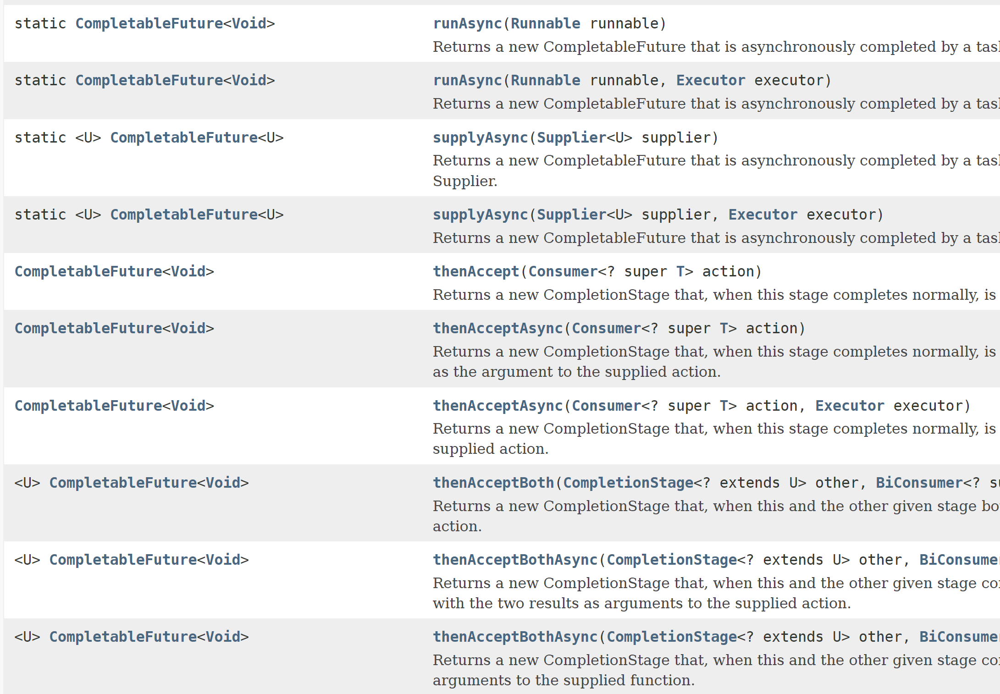

### Intro

[`Executor Service`](/blog/java-executor-service/) 에 이어서 스레드와 동시성 처리에 중요한
`Future`클래스에 대해서 정리합니다.

`Thread`클래스를 생성하여 `Task`를 실행하면 `Main Context`와 별도의 작업을 수행할 수 있습니다.
하지만 `Task`마다 `Thread`클래스 를 생성하는 것은 CPU 코어보다 많은 스레드를 생성할 수 있으며 
이 경우 스레드간의 경쟁이 심해져 성능이 저하될 수도 있습니다. 
# 
`Executors`클래스를 통해서 시스템 사양에 맞게 스레드 풀을 생성하여 서비스를 하는 것이 보다 안전한 멀티스레딩 코딩이며 
`ExecutorService`에서 제공하는 다양한 API를 사용할 수 있습니다.

# 
### Future Interface
`ExecutorService`를 사용하여 `Main Context`와 별도의 작업을 수행했는데 `Task`의 작업상태를 확인해야하는 경우가 있습니다. 
예를 들어 `Task1`가 완료된 후에 `Task2`를 실행 해야하는 경우라면 `Task1`의 완료상태를 확인해야할 것입니다.
다음과 같은 경우는 ExecutorService.submit()가 반환하는 작업상태를 참조하는 `Future`인터페이스를 사용해서 해결할 수 있습니다.


```java
{
    // ExecutorService
    ExecutorService exec = Executors.newSingleThreadExecutor();
    Callable<String> task = () -> {
        Thread.sleep(1000);
        return "task";
    };
    Future<String> future = exec.submit(task);
    String result = future.get();
    
    //RunnableTask
    FutureTask<String> future = new FutureTask<>(task);
    new Thread(future).start();  // Future 작업 실행
    String result = future.get();
}
```

`Future`인터페이스는 java.util.concurrent와 함께 JDK 1.5에 도입된 문법입니다.  
`Future`인터페이스는 비동기 작업의 결과를 추상화하여 작업을 관리하는 메서드를 제공합니다.
# 

<div class="TableWrapper">

| 메서드                                     | 설명                                                               |
|------------------------------------------|------------------------------------------------------------------|
| get()                                   | 연산의 결과를 반환합니다. 만약 연산이 아직 완료되지 않았다면, 완료될 때까지 대기하게 됩니다.            |
| get(long timeout, TimeUnit unit)        | 지정한 시간 동안만 결과를 기다리고 지정된 시간안에 결과가 반환되지 않으면 `TimeoutException`을 던집니다 |
| isDone()                                | 작업완료 여부를 반환합니다.                                                  |
| cancel(boolean mayInterruptIfRunning)   | 작업을 취소합니다. 매개 변수는 작업이 진행 중일 때 중단해도 되는지를 결정합니다.                   |
| isCancelled()                           | 작업취소 여부를 반환합니다.                                                  |

</div>

#
```java
Callable<String> task = () -> {
    Thread.sleep(1000);
    return "task";
};
FutureTask<String> future = new FutureTask<>(task);
new Thread(future).start();  // Future 작업 실행

// Main Thread와 별도로 task를 수행중이므로 
// 비동기적으로 다른 작업을 수행할 수 있습니다.
System.out.println("결과를 받기전에 다른 작업");

// 작업완료 여부를 확인합니다.
if (future.isDone()) {
    System.out.println("작업 완료");
} else {
    System.out.println("작업 진행 중");
} 

// 실행 중인 작업을 중단
boolean cancelled = future.cancel(true); 
if (cancelled) {
    System.out.println("작업 취소됨");
} else {
    System.out.println("작업 취소 실패");
}

// 결과를 받기 위해 대기합니다.
String result = future.get();
```
`Future`인터페이스의 메서드를 활용하여 앞서 말씀드린
`Task1`이 완료되면 `Task2`를 실행하고 싶은 상황을 해결해보겠습니다.

```java
ExecutorService executorService = Executors.newSingleThreadExecutor();

// task1 정의
Callable<String> task1 = () -> {
    Thread.sleep(1000); // task1이 오랜 시간이 걸리는 작업이라 가정
    return "task1 done";
};

// task2 정의
Callable<String> task2 = () -> {
    Thread.sleep(500); // task2가 오랜 시간이 걸리는 작업이라 가정
    return "task2 done";
};

try {
    // task1 실행 및 완료 대기
    Future<String> future1 = executorService.submit(task1);
    String result1 = future1.get();
    System.out.println(result1); // task1의 결과 출력

    // task2 실행 및 완료 대기
    Future<String> future2 = executorService.submit(task2);
    String result2 = future2.get();
    System.out.println(result2); // task2의 결과 출력

    // ExecutorService 종료
    executorService.shutdown();
} catch (InterruptedException | ExecutionException e) {
    e.printStackTrace();
}
```
위 코드는`Task1`이 완료된 것을 확인한 다음`Task2`를 실행하는 코드입니다.
`Task1`의 결과를 확인하고 `Task2`를 실행하기 위해서 Future.get()을 실행하는 것은
`Task1`의 결과를 받기 위해서 대기해야하기 때문에 진정한 동시성이라고 보기 힘듬니다.
그리고 2개의 `Task`를 실행하기 위해서 생각보다 긴 코드를 작성해야합니다. 
만약 `Task3`을 실행해야 하는 상황이라면 더 장황한 코드를 생성해야합니다.
`Future`인터페이스가 비동기작업에 대한 메서드를 제공하지만 실제 사용해보면 많은 제약사항이 있습니다.

### Future Interface의 한계
- 여러 개의 다른 `Future`인터페이스를 결합해서 사용하기 힘듭니다. 
- 여러 개의 `Future`인터페이스를 체이닝해서 사용하기 힘듭니다.
- `Future`인터페이스는 수동으로 `completed`를 설정할 수 없습니다.
- `Future`인터페이스는 예외에 대한 처리가 부족합니다.
- `Task`가 완료됬을 때 `Callback`을 연결하기 어렵습니다.


### CompletableFuture Class
`CompletableFutre`클래스는 `Future`인터페이스의 한계점을 보완하기 위해서 JDK8에서 소개되었습니다.
`CompletableFutre`클래스는 `Future`인터페이스와 여러 개의 비동기 작업을
조합할 수 있는 메서드를 가진 `CompletionStage`인터페이스를 구현합니다.

```java
public class CompletableFuture<T> implements Future<T>, CompletionStage<T>
```
CompletableFuture가 비동기 작업을 관리하기 위해서 제공하는 풍부한 메서드는 아래와 같습니다.
<div class="TableWrapper">


| 메서드                  | 설명                                                         |
|-----------------------|--------------------------------------------------------------|
| supplyAsync()       | 비동기적으로 작업을 실행하고 결과를 반환합니다.                 |
| runAsync()          | 비동기적으로 작업을 실행하지만 결과를 반환하지 않습니다.       |
| thenApply()         | 이전 작업의 결과를 입력으로 받아 결과를 반환하는 함수를 적용합니다. |
| thenAccept()        | 이전 작업의 결과를 입력으로 받아 결과를 소비하는 함수를 실행합니다. |
| thenRun()           | 이전 작업이 완료된 후에 특정 작업을 실행합니다.               |
| thenCompose()       | 이전 작업의 결과를 입력으로 받아 CompletableFuture를 반환하는 함수를 적용합니다. |
| thenCombine()       | 다른 CompletableFuture의 결과와 조합하여 결과를 반환합니다.   |
| exceptionally()     | 작업 중 예외가 발생했을 때 대체 동작을 수행합니다.            |
| handle()            | 작업의 결과나 예외를 처리하고 다른 결과를 반환합니다.         |
| complete()          | CompletableFuture를 완료 상태로 만듭니다.                   |
| completeExceptionally() | CompletableFuture를 예외 상태로 만듭니다.              |
| cancel()            | CompletableFuture를 취소합니다.                             |
| isDone()            | 작업이 완료되었는지 여부를 반환합니다.                      |
| join()              | 작업의 결과를 반환하거나 예외가 발생한 경우 예외를 다시 던집니다. |

</div>



`CompletableFuture`의 메서드의 return값은 또 다른 CompletableFuture을 반환합니다.
그러므로 `Task1`의 작업이 완료되면 `thenRun`과 같은 메서드를 이용하여 다음 `Task2`를 손쉽게 수행할 수 있습니다.
위 메서드들을 활용하여 `Future`인터페이스의 한계점을 `CompletableFuture`클래스는 어떻게 보완할 수 있는지 살펴보겠습니다. 

<div class="Line"></div>

**여러 개의 다른 Future 인터페이스를 결합해서 사용하기 힘듭니다.**  
`thenCombine()`를 통해서 다른 작업의 결과와 조합하여 결과를 반환할 수 있습니다.

```java
CompletableFuture<Integer> future1 = CompletableFuture.supplyAsync(() -> 1);
CompletableFuture<Integer> future2 = CompletableFuture.supplyAsync(() -> 2);

CompletableFuture<Integer> combinedFuture = future1.thenCombine(future2, (result1, result2) -> result1 + result2);
combinedFuture.thenAccept(System.out::println); // 결과: 3
```

<div class="Line"></div>

**여러 개의 `Future`인터페이스를 체이닝해서 사용하기 힘듭니다.**  
`then` 메서드의 결과값이 `CompletableFuture`이므로 비동기 작업을 체이닝하여 연결할 수 있습니다.
```java
CompletableFuture.supplyAsync(() -> 1)
                 .thenApply(result -> result * 2)
                 .thenApply(result -> result * 3)
                 .thenAccept(System.out::println); // 결과: 6
```

<div class="Line"></div>

**`Future`인터페이스는 수동으로 `completed`를 설정할 수 없습니다.**  
`complete()` 메서드를 사용하여 수동으로 작업을 완료할 수 있습니다.
```java
CompletableFuture<String> future = new CompletableFuture<>();
// 수동으로 작업 완료
future.complete("Task completed");
// 결과: Task completed
future.thenAccept(System.out::println); 
```

<div class="Line"></div>

**`Future`인터페이스는 예외에 대한 처리가 부족합니다.**  
`exceptionally()` 메서드를 사용하여 예외를 처리할 수 있습니다.
```java
CompletableFuture<String> future = new CompletableFuture<>();
// 예외 발생
future.completeExceptionally(new RuntimeException("Task failed"));
// 예외 처리 코드
future.exceptionally(ex -> {
    System.out.println("Exception occurred: " + ex.getMessage());
    return null;
});
```

<div class="Line"></div>

**`Task`가 완료됬을 때 `Callback`을 연결하기 어렵습니다.**  
`thenApply`, `thenAccept`, `thenRun` 등의 메서드를 사용하여 작업 완료 시 콜백을 등록할 수 있습니다.
```java
CompletableFuture.supplyAsync(() -> "Task result")
                 .thenApply(result -> result.toUpperCase())
                 .thenAccept(result -> System.out.println("Result: " + result));
```

### Outro
`CompletableFuture`클래스를 잘 활용하면 보다 깔끔하게 비동기 작업을 수행할 수 있습니다.