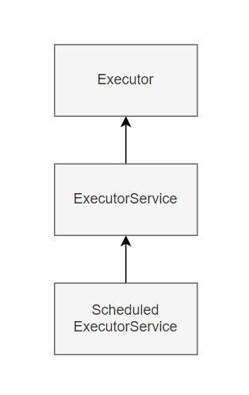

### Intro

과거에는 무어의 법칙에 따라 CPU에 들어가는 트랜지스터의 수가 증가하여 CPU 속도가 향상되었습니다. 그러나 최근에는 컴퓨터에 들어가는 CPU의 코어의 개수를 늘여서 속도를 향상시키고 있습니다. 그러므로
애플리케이션도 CPU의 코어들을 활용해야 속도를 향상시킬 수 있습니다. 그럼 어떻게 Java에서는 CPU의 코어를 잘 활용할 수 있을까요?

#  

정답은 `Thread`입니다. `Thread`를 이용하면 한 프로세스 내에서 두 가지 또는 그 이상의 일을 동시에 할 수 있습니다.
`JVM`에서 `Thread`마다 `PC-register`, `Java Stack`과 `Native Stack`을 가지므로 `Main-Thread`와 별도로 실행 Context를 갖고 동작할 수 있습니다.
Java에서 `Thread`를 생성하는 방법은 다음과 같습니다.

```java
class NewThread extends Thread {
    @Override
	public void run() {
		System.out.println("task");
	}
	public static void main(String[] args) {
        NewThread newThread = new NewThread();
        NewThread.start();  // start()로 쓰레드를 실행합니다.
    }
}
```

`Thread` 클래스를 상속하여 run() 구현하고 Thread의 start()를 호출하면 Thread가 동작하게 됩니다. 이렇게 `Thread`를 구현하면 `Main Thread`와 별도의 작업을 수행할 수
있습니다.
`Thread`를 통해서 여러 작업을 동시에 실행할 수 있습니다. `Thread`는 어떤 언어에서도 동시성 프로그래밍의 기본이됩니다.

#  

Tomcat과 같은 웹 서버에서는 여러 클라이언트의 요청을 동시에 처리하기 위해서 스레드를 사용합니다. 만약 웹 서버에 클라이언트가 동시에 요청할 때마다 `Thread`를 생성하고 요청을 처리한다면 어떻게 될까요?
`Thread`를 생성할때마다 해당 `Thread`에 대한 메모리 공간이 할당되고, 스케줄링 및 컨텍스트 전환에 필요한 추가적인 시스템 리소스가 소비됩니다.   
어느 순간 너무 많은 `Thread`를 생성하게 되어 CPU코어 수보다 훨씬 많을 때는 스레드 간의 경쟁이 심해져 성능이 저하될 수도 있습니다. 그래서 Tomcat과 같은 웹 서버는 서버 사양에
맞게 `Thread Pool`을 구성하여 클라이언트의 요청을 처리합니다. Java에서도 `Thread`를 직접 생성하는 것보단 Java에서 제공하는 ExecutorService를 활용하는 것이 일반적으로 더 좋은
방법입니다.

### java.util.concurrent 패키지

`java.util.concurrent` API는 JDK 1.5에 추가되었습니다.
`concurrent API`는 스레드를 실행하고 관리하는 고수준 API를 사용한 Executors 클래스를 제공하며 원자적 변수 동기화를 위한 Atomic 패키지를 제공함으로써 synchronized 키워드의
사용을 최소화하도록 설계하였습니다.
`concurrent API`를 활용하면 보다 수월하고 안전하게 병렬 프로그래밍을 할 수 있습니다.

<div class="tableWrapper">

| 패키지명                       | 설명                                        | 
|----------------------------|-------------------------------------------|
| java.util.concurrent       | 비동기 태스크 실행과 스레드의 생성,관리를 위한 다양한 인터페이스와 클래스 |
| java.util.concurrent.atom  | 데이터에 대한 정합성을 확보하기 위하여 원자적 변수 선언 기능    |
| java.util.concurrent.locks | 객체에 대한 잠금, 대기 기능을 제공하는 유틸리티 클래스와 인터페이스    |

</div>

### Executor Interface
`Executor Interface`는 `Runnable`를 실행하는 execute() 메서드를 갖고 있는 인터페이스입니다.
Task를 실행하는 가장 기본이 되는 인터페이스입니다.
# 
`Runnable Interface`는 `Thread` class를가 구현을 하는 인터페이스이며 Task를 나타냅니다.
`Runnable Interface`는 다음과 같이 선언할 수 있습니다.
```java
public class Thread implements Runnable { 
    // Thread는 Runnable 인터페이스를 구현합니다.
    ...
}
public static void main(String[] args) {
    // Task를 선언
    Runnable runnable = new Runnable() {
        @Override
        public void run(){
            System.out.println("task");
        }
    }
    Thread thread = new Thread(runnable);
    thread.start();
}
```
# 
```java
public interface Executor {
    void execute(Runnable command);
}
// Exectuor를 통한 Task 실행
class DirectExecutor implements Executor {
   public void execute(Runnable task) {
     // 실행방법 - 1
     task.run();
     // 실행방법 -2 
     new Thread(r).start();
   }
 }
    
```
다음과 같이 `Runnable`을 통해서 `Task`를 선언하면 작업과 작업자를 분리해서 관리할 수 있습니다.
그러면 `Executor`를 통해서 `Runnable Task`를 실행할 수 있습니다. 어떻게 보면 `Executor`를 활용해서 `Task`를 실행하는 것이 Thread를 생성하는거랑 크게 다르지 않은 느낌입니다. 
그러므로 `Executor Interface`를 직접 구현하는 것보단 `Conccurent API`에서 제공하는 다른 인터페이스와
클래스를 활용하는 것이 좋습니다.
# 

### Executors class

`ExecutorService`는 `Executor`를 상속하여 `Thread`를 생성하고 관리하기 위한 메서드를 제공합니다.
`ExecutorService`를 직접 구현하는 것은 어렵거나 시간이 걸리기 때문에 
`Concurrent API`에서는 Executors 클래스를 이용해 병렬 처리에 필요한 여러가지 메서드를 정의해서 제공합니다.
# 
**newSingleThreadExecutor**
- 하나의 스레드로 처리하어 하나의 `Task`만 처리됩니다.
- 다른 요청은 현재 `Task`가 종료될 때까지 대기합니다.
# 
**newFixedThreadPool**
- 입력 파라미터만큼 스레드를 생성하여 스레드 풀을 구성합니다. 
- 스레드 풀의 크기만큼 병렬 처리합니다.
- 스레드 풀의 크기보다 많은 `Task`가 요청되면 대기합니다.
```java
public static ExecutorService newFixedThreadPool(int nThreads, ThreadFactory threadFactory) {
    return new ThreadPoolExecutor(nThreads, nThreads,
                                  0L, TimeUnit.MILLISECONDS,
                                  new LinkedBlockingQueue<Runnable>(),
                                  threadFactory);
}
```
#
**newCachedThreadPool**
- 1개의 스레드로 시작하여 `Task` 요청대로 스레드가 생성됩니다.
- 다만 60초 동안 IDLE한 `Thread`가 있으면 해당 스레드는 Pool에서 제거됩니다.
- 60초 안에 `Task` 요청이 들어오면 생성했던 스레드로 작업을 수행합니다.
```java
public static ExecutorService newCachedThreadPool() {
    return new ThreadPoolExecutor(0, Integer.MAX_VALUE,
                                  60L, TimeUnit.SECONDS,
                                  new SynchronousQueue<Runnable>());
} 
```
# 
**newWorkStealingPool**
- 내부적으로는 ForkJoinPool을 생성하여 병렬처리합니다.
- 병렬 수준을 최대한 유지하기 위해서 CPU코어를 선점하려고 하기 떄문에 다른 애플리케이션에 영향을 줄 수 있습니다. 
```java
public static ExecutorService newWorkStealingPool(int parallelism) {
    return new ForkJoinPool
        (parallelism,
         ForkJoinPool.defaultForkJoinWorkerThreadFactory,
         null, true);
}
```

### Example
`Executors`클래스를 통해서 싱글스레드플을 생성하여 Task를 실행할 수 있습니다.
execute 메서드는 리턴값이 없는 Executor 인터페이스의 메서드입니다.
```java
{
    ExecutorService exec = Executors.newSingleThreadExecutor();
    Runnable runnable = () -> System.out.println("task");
    exec.execute(runnable);
}
```
만약 Task의 결과를 확인하기 위해서 `ExecutorService`.submit 메서드 사용해야합니다.
`submit` 메서드는 실행결과에 대한 참조 객체 `Future`을 반환합니다.
`Future`인터페이스의 `get()`을 실행하면 `Task`의 작업상태가 완료가 될 때까지 `Main-Thread`가 대기하게 됩니다.

```java
{
    ExecutorService exec = Executors.newSingleThreadExecutor();
    Runnable runnable = () -> System.out.println("task");
    Future<?> submit = exec.submit(runnable);
    submit.get(); 
}
```

만약 Task의 실행결과에 반환값이 있는 경우는 `Runnable`대신 `Callable`인터페이스를 사용할 수 있습니다.
`Callable` 인터페이스는 `Runnable` 인터페이스와 달리 제네릭 타입으로 결과를 반환하게 됩니다.

```java
@FunctionalInterface
public interface Callable<V> {
    V call() throws Exception;
}

ExecutorService exec = Executors.newSingleThreadExecutor();
Callable<String> callable = () -> {
    Thread.sleep(1000);
    return "task";
};
Future<String> future = exec.submit(callable);
String result = future.get();

```