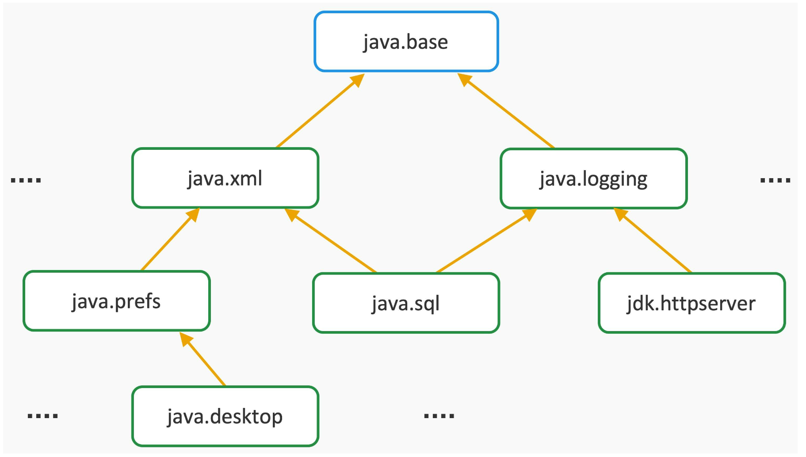

### Intro
JDK8에서 함수형 프로그래밍, 람다식이 추가된 이후 Java는 새로운 기능들을 많이 선보이고 있습니다.

JDK 9에서는 크게 3가지 기능이 추가 되었습니다.  
1.모듈 시스템이 추가되면서 Java 애플리케이션을 실행하기 위해서 꽤 큰 용량의 rt.jar가 필요했던 부분이 개선되었습니다.  
2.개발 패러다임이 모놀리식에서 마이크로서비스으로 변화하면서 이벤트를 다룰 수 있는 리액티브 스트림 API가 추가 되었습니다.  
3.JShell과 같은 대화형 셸이 추가되어 Java 코드를 입력하고 즉시 실행하여 결과를 확인할 수 있게 되었습니다.  

JDK9에서 가장 큰 변화라고 생각되는 모듈시스템을 살펴보겠습니다.

### Module System Strong Point

Java 9 이전에는 Java 애플리케이션을 실행하기 위해 JRE 환경을 위한 rt.jar 파일이 필요했습니다. 
rt.jar의 용량은 대략 65MB로, 도커 컨테이너를 만드는 것을 생각해보면 꽤 큰 용량입니다. 
Java 9의 Jlink로 사용하는 모듈과 의존성만으로 JRE 환경을 만들 수 있습니다. 
그러므로 경량화된 패키지로 애플리케이션을 배포할 수 있게 됩니다.
# 
Java 9에서는 exports하지 않은 클래스 모듈은 외부에서 직접 접근할 수 없도록 변경되었습니다.
이를 통해 내부 API 및 내부 클래스들이 캡슐화되어 느슨한 결합을 유지함으로써 유지보수성이 향상되었습니다.
# 
JVM이 구동될 때 필요한 모듈을 찾을 수 없으면 Missing Module 에러가 발생합니다.
이를 통해 런타임 중에 발생할 수 있는 잠재적인 문제를 사전에 방지할 수 있습니다.

### Module System


모듈 시스템을 적용하여 1개의 모놀리식이었던 JDK를 73개의 모듈로 세분화 하였습니다. java.base는 모듈 시스템의 기본이 되는 모듈입니다. java.base 외 다른 모듈은
java.base를 항상 의존하고 있습니다. 73개의 모듈은 위와 같이 그래프로 표현이 가능하며 모듈 그래프를 통해서 모듈 어플리케이션이
어떻게 의존하고 있는지 확인할 수 있습니다.
# 
아래 커맨드를 통해 현재 사용하고 있는 Java의 모듈 구성을 확인할 수 있습니다.

```java
java --list-modules // jdk의 시스템 모듈을 확인할 수 있습니다.

java.base@11.0.12
java.compiler@11.0.12
java.datatransfer@11.0.12
java.desktop@11.0.12
java.instrument@11.0.12
```


# 
### module-info.java

- Java9부터 Java프로그램은 모듈로 패키징해야하며 모듈에 대한 메타정보를 필수적으로 표현해야합니다. 모듈의 루트 디렉토리에 모듈의 이름, 의존성 모듈 그리고 공개할 패키지에 대해서 [module-info.java](http://module-info.java) 에 기재합니다.

```java
module modulename { // module 이름을 정의합니다.
	requires modulename; // 의존하는 모듈을 명시
	requires static modulename; // 컴파일 타임에 의존하는 모듈을 명시
	requires transitive modulename; // 아래에서 소개.
	exports com.jovialcode.jdk9 // jdk9 패키지 내 public 접근제어자를 외부로 공개
	exports com.jovialcode.common to moduleA // common 패키지를 특정 모듈(moduleA)에게만 공개
	uses com.example.ServiceInterface // 특정 구현체만 사용하도록 설정 (서비스 소비자)
	provides com.example.ServiceInterface with com.example.ServiceProvider; // 특정 구현체만 사용하도록 오픈 (서비스 제공자)
	opens com.jovialcode.common // common 패키지 Reflection만 공개
	opens com.jovialcode.common to moduleA // common 패키지를 특정 모듈에게만 Reflection 공
}
```

transitive dependency는 A → B → C와 같은 관계에서 나타납니다. B → C를 의존하고 있는 상태에서 A → B를 의존하게 되면 A에서 C를 의존하는 관계입니다. 이로 인해서 버전이 오버라이딩되거나 하는 문제가 발생했었습니다. 이러한 문제점을 해결하기 위해서 requires transitive를 통해서 transitive dependency 관계도 명시할 수 있습니다.

```java
// ModuleA는 ModuleC를 직접적으로 사용할 수 있습니다.
module moduleA {
    requires transitive moduleB;
}

module moduleB {
    requires transitive moduleC;
}
```

```java
// ModuleA는 ModuleC를 직접적으로 사용할 수 없습니다.
module moduleA {
    requires moduleB;
}

module moduleB {
    requires moduleC;
}
```

#### Reference
- https://developer.ibm.com/tutorials/java-modularity-2/