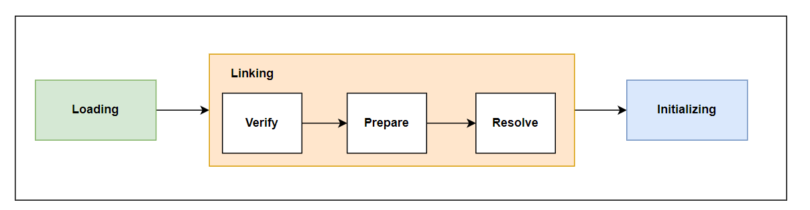

### Intro
`Bytecode`를 담고 있는 `.Class`파일은 `JVM(Java Virtual Machine)`의 `ClassLoader`에 의해 해석되어 실행됩니다.
어떤 과정을 거쳐서 우리가 작성한 변수들이 해석되어 메모리에 로딩되는지 알아보겠습니다.

### ClassLoader
`JVM`의 `ClassLoader`는 `Boostrap ClassLoader`, `Extension ClassLoader`, `Application ClassLoader`로 구성된 3계층 구조로 이뤄져있습니다. (~JDK8)
이 3계층 구조에서 각 클래스 로더가 특정 역할에 맞는 클래스를 로딩하도록 설계되어 있습니다. 
# 
`BootStrap ClassLoader`는 `JVM`의 네이티브 코드로 구현된 클래스로더입니다. `BootStrap ClassLoader`외 `ClassLoader`는 외부 클래스로더로 구분합니다.
`JAVA_HOME/lib`디렉토리나 `-Xbootclasspath` 매개 변수로 지정한 경로에 위치한 파일과 `JVM 클래스 라이브러리`를 로드하는 일을 책임집니다.
`rt.jar`를 로드합니다.
#
`Extension ClassLoader`는 `JDK`에 필요한 확장 라이브러리(java 3D, JavaMail 등)를 로드합니다. 
`JAVA_HOME/lib/ext`에 있는 클래스를 로드합니다.

# 
`Application ClassLoader`는 애플리케이션에 필요한 클래스를 로드합니다.
`ClassPath`에 지정된 경로에서 클래스를 로드하며 애플리케이션의 진입점인 `main`메서드를 포함한 클래스를 로드합니다.
우리가 작성한 코드를 로드하는 것이 `Application ClassLoader`의 역할입니다.

<div class="tableWrapper">

| **ClassLoader**        | **설명**                                                                                                                                     | **로드 경로**                 |
|--------------------------|---------------------------------------------------------------------------------------------------------------------------------------------|-----------------------------|
| **BootStrap ClassLoader** | - JVM의 기본 동작에 필요한 코드를 로드합니다.<br> - Java ClassLoader를 로드합니다.<br> - `rt.jar`에 속한 클래스를 로드합니다.<br> - 최상단의 ClassLoader입니다. | JVM 기본 클래스 경로           |
| **Extension ClassLoader** | - BootStrap의 자식입니다.<br> - JDK에 필요한 라이브러리를 로드합니다.<br> - `jre/lib/ext` 디렉토리를 로드합니다.<br> - 시스템 속성(system property)을 설정합니다. | `jre/lib/ext` 디렉토리         |
| **Application ClassLoader** | - 애플리케이션에 필요한 클래스를 로드합니다.<br> - `ClassPath`에 기재된 클래스를 로드합니다.<br> - 애플리케이션의 진입점인 `main` 메서드를 포함한 클래스를 로드합니다. | 사용자 지정 클래스 경로          |

</div>

`ClassLoader`는 클래스를 로딩할 때 부모 `ClassLoader`에게 먼저 클래스를 로드할 것을 위임합니다.
그리고 부모 `ClassLoader`가 해당 클래스를 로딩할 수 있는지를 확인하고 클래스를 로드하지 못하면 findClass()로 클래스를 로드하게 됩니다.

```java
Bootstrap Class Loader
      ↑
Extension Class Loader
      ↑
Application Class Loader
```

이렇게 부모 `ClassLoader`가 클래스를 로딩하도록 위임하는 것은 동일한 클래스파일을 로딩하더라도 로드한 `ClassLoader`가 다르면 
`JVM`에서 다른 클래스로 인식되어 여러개의 클래스 파일이 존재하게 됩니다.  
(`ClassLoader`는 클래스를 로드한 다음에 각 클래스의 메타정보에는 어떤 `ClassLoader`가 로드한 것인지를 기록합니다.)
# 
`ClassLoader`에 의해서 클래스가 로딩되면 해당 `클래스의 타입정보`를 `메서드 영역`에 저장합니다.
그리고 `java.lang.Class`라는 객체를 생성하여 `메서드 영역`에 저장된 클래스의 타입 정보를 가리키도록 설정한 후 자바의 `Heap` 메모리에 저장합니다. 
이 `Class`객체는 프로그램에서 메서드 영역 안의 타입 데이터에 접근하기 위한 통로 역할을 합니다.

### ClassLoading

`ClassLoader`에 의해 로드된 클래스들을 `동적 링킹` 과정을 거쳐 초기화합니다.
C++언어는 `컴파일 타임`에 링킹을 하는 `정적 링킹`인 반면 `Java`는 `런타임`에 링킹을 하기 때문에 애플리케이션 구동 초기에 오버헤드가 있는 편입니다.
하지만 이러한 `동적 링킹` 덕분에 클래스 `동적 로딩 / Lazy 로딩`이 가능하며 `Bytecode`는 플랫폼에 독립적일 수 있습니다. 
#
링킹 단계는 3단계로 구성됩니다.
`Verify` -> `Prepare` -> `Resolve` 각 단계는 병렬적으로 수행이 가능합니다.
위 순서는 시작시점을 기준으로 나타냅니다.
# 
**Verify**   
`검증`단계에서는 클래스 파일의 `바이트스트림`에 담긴 정보가 `JVM 명세`에서 규정하는 제약을 만족하는지 확인합니다.
`클래스 파일`이 꼭 `java코드`로부터 `컴파일`되어야 하는 것은 아닙니다. 
바이너리 편집기로 바이트스트림을 작성할 수도 있습니다. 
그래서 만약에 악의적으로 작성된 바이트코드 스트림이 로드될 수도 있기 때문에 `JVM명세`에 만족하는지 검증을 합니다.
#
- **파일 형식 검증**
  - `바이트스트림`의 시작이 매직넘버인가?  
  - `메이저 버전`과 `마이너`버전이 현재 JVM이 허용하는 범위에 속하는가?  
  - 존재하지 않는 상수나 타입을 가리키는 경우는 없는가?
- 메타데이터 검증
  - 상위 클래스 또는 인터페이스에서 정의한 필수 메서드를 모두 구현했는가?
  - 필드와 메서드가 상위 클래스와 충돌하는가?
- 바이트코드 검증
  - 메서드 본문인 Code속성에서 StackMapTable의 속성이 잘못 되었는가?
- 심벌 참조 검증
  - 클래스 파일에 존재하는 `심벌 참조`가 올바른가?
#

`검증`단계에서 `파일 형식 검증`을 완료하면 후 메서드 영역에 클래스 타입 정보를 저장합니다.
앞서 `클래스로더`가 `클래스파일`을 로딩하면 `메서드 영역`에 `타입 정보`가 저장된다고 말씀드렸는데
로딩 단계와 링킹의 검증 단계는 어느 정도 겹쳐있습니다.
#
**Prepare**  
`준비`단계에서는 `클래스 변수(정적 변수)`를 메모리에 할당하고 초깃값을 설정합니다.
`클래스 변수`는 `클래스 객체`와 함께 `Heap`에 저장되고 이때 `final`를 제외한 변수는 0과 같은 Default값으로 초기화 됩니다.

```java
// final로 선언된 경우에만 100으로 할당됩니다.
// final은 바이트코드에서 ConstantValue속성을 입니다.
public static final int value = 100; 
```
#
**Resolve**  
`해석`단계에서는 `심벌 참조`를 `직접 참조`로 대체하는 과정입니다.
이 단계에서는 `필드`, `메소드`, 다른 `클래스`나 `인터페이스`를 참조할 때 사용되는 `심벌(이름)`을 해당하는 실제 메모리 위치로 연결합니다.
`심벌 참조`는 클래스 파일 내 `상수 풀`에 저장되어 있습니다.

```java
 > javap -v -c .\Bytecode.class
Classfile /java/main/org/jovialcode/base/Bytecode.class
  Last modified 2024. 5. 12.; size 444 bytes
  MD5 checksum 241941b8981b9e32e706593708b84fcb
  Compiled from "Bytecode.java"
public class org.jovialcode.base.Bytecode
  minor version: 0 //마이너 버전
  major version: 62 //메이저 버전
  flags: (0x0021) ACC_PUBLIC, ACC_SUPER // 접근 제어자
  this_class: #9 //Bytecode 클래스 인덱스  // org/jovialcode/base/Bytecode
  super_class: #2 //Bytecode가 상속하는 클래스  // java/lang/Object
  interfaces: 0, fields: 1, methods: 2, attributes: 1
Constant pool: //상수풀
   //`#1 Methodref`는 `java/lang/Object` 클래스의 `<init>`메소드를 가리킵니다.  
   #1 = Methodref          #2.#3          // java/lang/Object."<init>":()V
   //`#2 Class`는 `java/lang/Object`클래스를 나타내는 `심벌참조`입니다.
   #2 = Class              #4             // java/lang/Object
   #3 = NameAndType        #5:#6          // "<init>":()V
   #4 = Utf8               java/lang/Object
   #5 = Utf8               <init>
   #6 = Utf8               ()V
```
# 
### Initializing
`초기화` 단계에서는 `클래스변수`에 `초기값`이 할당됩니다. 
이전에 `준비`단계에서는 `클래스변수`에 `기본값`으로 0이 할당되어 있었습니다.
`클래스변수`에 `초기값`을 할당하기 위해서 클래스 생성자인 `<clinit>` 메서드가 실행됩니다. 
`<clinit>` 메서드는 `클래스 변수` 할당과 `정적 문장 블록(static {})`이 실행되는데 
이 코드는 컴파일러에 자동으로 생성되는 부분입니다.

### Outro
`초기화`단계까지 마치면 클래스 파일이 `JVM` 로드되어 
우리가 작성한 대로 애플리케이션이 구동됩니다. 
