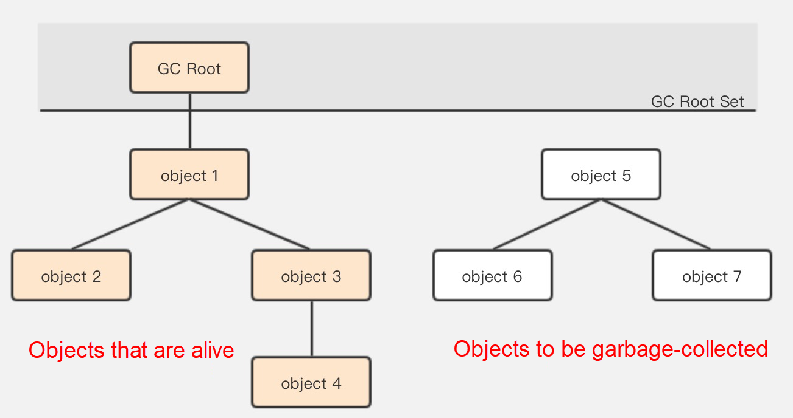
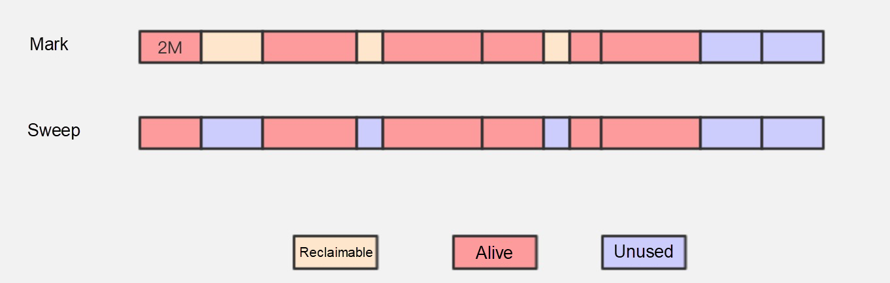
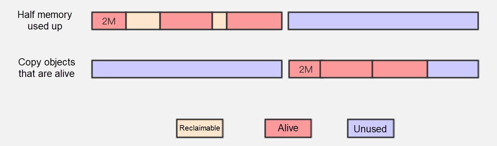
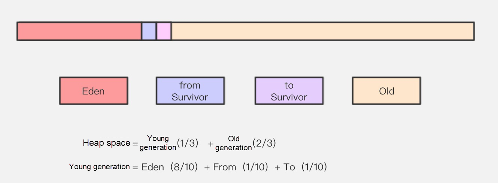
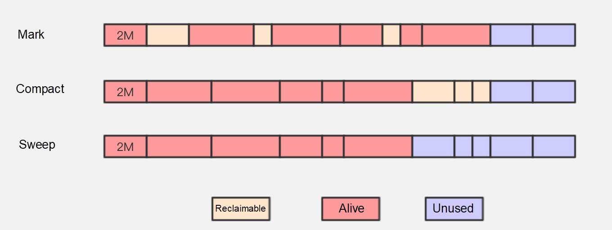

### Intro
`Java`는 C++언어와 달리 메모리를 자동으로 할당/회수 처리합니다.
이를 위해 `JVM`에는 `Garbage Collector`가 있습니다.
`Garbage Collector`가 사용하지 않거나 참조되지 않은 객체를 찾아서 할당된 메모리를 해제하는 과정을 
`Garbage Collection`이라 부르며 줄여서 `GC`라고 합니다.
#  
`GC`와 관련해서는 `JDK` 버전 별로 다양한 `Garbage Collector`가 존재하며 다양한 알고리즘들이 존재합니다. 
그러므로 내용을 나눠서 정리하고자 합니다. 또한, `JVM` 구현체마다 `GC`프로세스가 다릅니다. 
여기서 정리하고자 하는 것은 일반적으로 많이 사용하는 `Oracle HotSpot JVM`입니다.

### Stop the world
`GC`가 수행되는 과정에서 `JVM`의 `모든 스레드`가 일시 중지되는 상태가 있습니다. 
이것을 `STW(Stop The World)`라고 하는데 
`Garbage Collector`가 객체 참조 그래프를 안전하게 생성하기 위해서는 `STW`가 발생할 수 밖에 없습니다.
그러므로 `STW`의 시간이 최소화 되도록 `GC`는 빠르고 효과적으로 수행되어야 합니다.

### Reachability Analysis
`Garbage Collection`은 사용되지 않거나 참조되지 않은 객체를 찾아 메모리를 해제하는 과정입니다. 
이를 위해 먼저 객체가 사용되지 않거나 다른 객체에 의해 참조되지 않는지 판단해야 합니다. 
`Java`에서는 `도달 가능성 분석(Reachability Analysis)` 알고리즘을 통해 객체가 참조되고 있는지 여부를 결정합니다.
# 

`도달 가능성 분석`는 `GC Roots(Garbage Collection Roots)`에서 시작합니다. 
`GC Roots`는 탐색의 시작이 되는 노드이며 `GC Roots`로 이용할 수 있는 객체는 정해져있습니다.
- 현재 실행 중인 메서드에서 쓰는 매개변수, 지역변수, 임시 변수 등
- 자바 클래스의 참조 타입 정적 변수
- 문자열 테이블 안의 참조 
- 동기화 락으로 잠겨 있는 모든 객체
- 네이티브 메서드 스택에서 JNI가 참조하는 객체
- 자바 가상 머신 내부에서 쓰이는 참조 객체(예외 객체, Class 객체 등)
#
`GC Roots`의 참조 관계가 변하지 않아야하기 때문에 이 단계에서는 사용자 스레드가 일시중지됩니다.
`GC Roots`가 정해지면 `도달 가능성 분석`알고리즘은 간단하게 수행됩니다.
1. `GC Roots`에서부터 시작하여 해당 객체가 직접 참조하는 다른 객체들을 탐색합니다.
2. `참조 체인`을 따라가면서 방문된 객체를 도달 가능한 객체로 표시합니다.
3. 도달할 수 없는 객체는 `가비지`로 간주하여 `표시(Mark)`합니다.
`표시(Mark)`된 `가비지`는 `Garbage Collector`에 의해 메모리가 해제됩니다.

### Generational Collection Theory
`도달 가능성 분석`을 통해서 `가비지`로 판단된 객체의 메모리를 회수하는 것만으로 `GC`가 끝나지 않습니다.
`GC`를 거쳐서 살아남은 객체 또한 관리해야 효율적으로 메모리를 사용할 수 있습니다.
그러기 위해서 `Garbage Collector`는 `세대 단위 컬렉션 이론(Generational Collection Theory)`을 적용합니다.

#
`세대 단위 컬렉션 이론`은 대다수 프로그램에서 관측된 상황들에서 얻은 경험 가설에 근거합니다.
- `Young 세대 가설`: 대다수 객체는 일찍 죽는다.
- `Old 세대 가설`: `GC` 과정에서 살아남은 횟수가 늘어날수록 더 오래 살 가능성이 커진다.

이를 통해서 객체를 `Young` / `Old` 세대로 구분합니다.

### Mark And Sweep
 
`Mark-Sweep` 알고리즘은 가장 일반적인 가비지 컬렉션 알고리즘입니다.
먼저 `가비지`로 수집할 객체를 `마킹(Mark)`한 후 마킹된 객체를 `제거(Sweep)`합니다.
위 그림에서 볼 수 있듯이 `가비지`로 `마킹`된 메모리 공간은 `제거`되어 재사용할 수 있습니다.
#
그러나 재사용 메모리가 `파편화`가 되어 있어 충분한 크기의 연속된 메모리를 찾기가 점점 더 어려워지는 단점이 있습니다.
그리고 다량의 객체가 메모리에 존재한 상황에서 대부분이 회수 대상이라면 `마킹`하는 일과 `제거`하는 일 모두 효율이 떨어집니다.

### Mark and Copy

`Mark-Copy`알고리즘은 가용 메모리를 똑같은 크기의 `두 블록`으로 나눠서 한 번에 `한 블록`만 사용합니다.
`한쪽 블록`이 꽉 차면 살아남은 객체들만 다른 블록에 복사하고 기존 블록을 한번에 청소합니다.
#
대부분의 객체가 살아남는다면 메모리 복사에 상당한 시간을 허비할 수 있습니다. 
반대로 대부분이 회수가 된다면 생존한 소수의 객체만 복사하면 됩니다. 
복사하는 과정에서 객체들이 메모리의 한쪽 끝에서부터 쌓이기 때문에 `메모리 파편화`문제를 해결할 수 있습니다.
하지만 가용 메모리를 절반으로 줄여 사용하는 것은 낭비가 심하다는 단점이 있습니다.
# 
`IBM`은 `Young` 객체 중에 98%는 첫 번째 `GC`에서 살아 남지 못하다는 것을 정량적으로 분석했습니다.
그렇기 때문에 `Young`객체의 메모리를 1:1로 나눌 필요가 없다는 결론을 갖게 되었습니다.
이를 통해 `Young`영역을 `Eden`영역과 `2개의 작은 생존자`공간으로 나누게 되었습니다.

#
`HotSpot`에서는 기본적으로 `Young`영역에서 `Eden`영역을 80%로 나누고 나머지 10%씩 작은 생존자 공간에 할당합니다.
객체의 메모리를 할당할 때 `Eden`영역과 1개의 `생존자 공간`에 할당합니다. 
그리고 `GC`가 발생 후 살아남은 객체를 다른 `생존자 공간`으로 복사 한 후 `Eden`영역과 `생존자 공간`을 비웁니다. 

### Mark and Compact
`Mark-Copy` 알고리즘에서는 객체 생존율이 높을수록 복사할 게 많아져서 효율이 좋지 않습니다. 
그러므로 비교적 오래 생존하는 객체가 많은 `Old`영역에 적용하기에는 알맞는 알고리즘이 아닙니다.
이러한 `Old`영역의 생존 특성을 고려해서 개선된 `Mark-Compact` 알고리즘이 `Old`영역에 적용되어있습니다.

#
`Mark-Compact`알고리즘은 `Mark-Sweep`과 동일하게 `가비지`를 제거한 후 
생존한 모든 객체를 메모리 영역의 한 쪽 끝으로 모우는 알고리즘입니다.
그리고 나머지 공간을 비우는 것으로 메모리 파편화 문제를 해결합니다.
하지만 살아남은 객체들이 많을 경우 한 쪽 끝으로 옮기는 것은 효율이 떨어지는 단점이 있으며 
이 과정에서 일시적으로 `STW`가 발생합니다.
#
객체를 이동하지 않으면 `메모리 파편화`가 발생해서 자주 `GC`가 발생하므로 이과정에서 `STW`가 발생할 수 있습니다. 
객체를 이동해도 이과정에서 `STW`가 발생할 수 있으므로 두 선택지 모두 단점이 있습니다.
그래서 `Garbage Collector`에 따라서 다른 알고리즘이 적용되어 있으므로 사용하고 있는 `Garbage Collector`가 무엇인지 알 필요는 있습니다.
관련 내용은 `Garbage Collector`에서 정리해보겠습니다.

### Outro
`Java`언어가 자동으로 메모리 관리를 해주는 것은 이점이라고 생각하지만 그렇다고 해서 메모리 관리가 어떻게 되는지 몰라도 되는 것은 아니라고 생각합니다.
새로운 `JDK`가 나올 때마다 `GC`와 관련된 업데이트 내용이 많은 편이므로 내가 사용하는 `JDK`버전에 대한 `GC`는 숙지할 필요가 있겠습니다.

### Ref
- https://www.oracle.com/webfolder/technetwork/tutorials/obe/java/gc01/index.html
- https://www.alibabacloud.com/blog/how-does-garbage-collection-work-in-java_595387