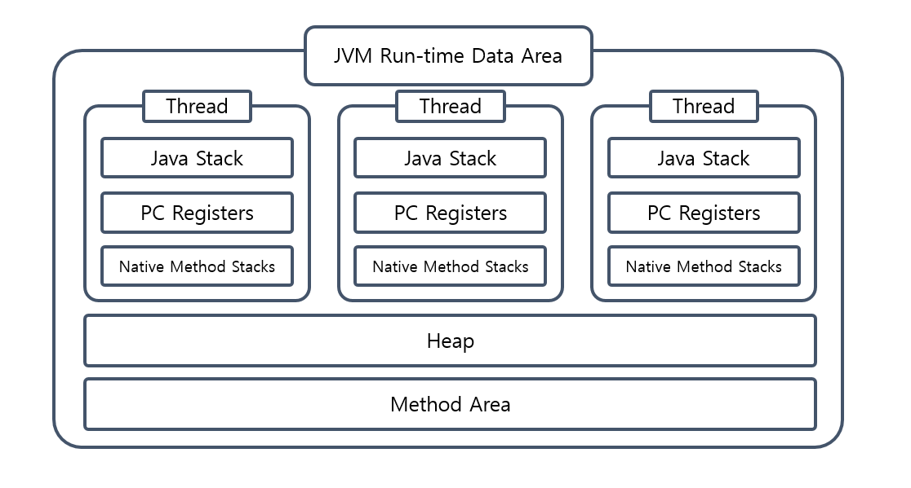
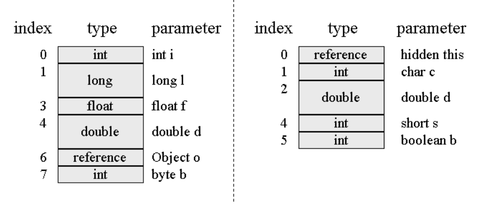
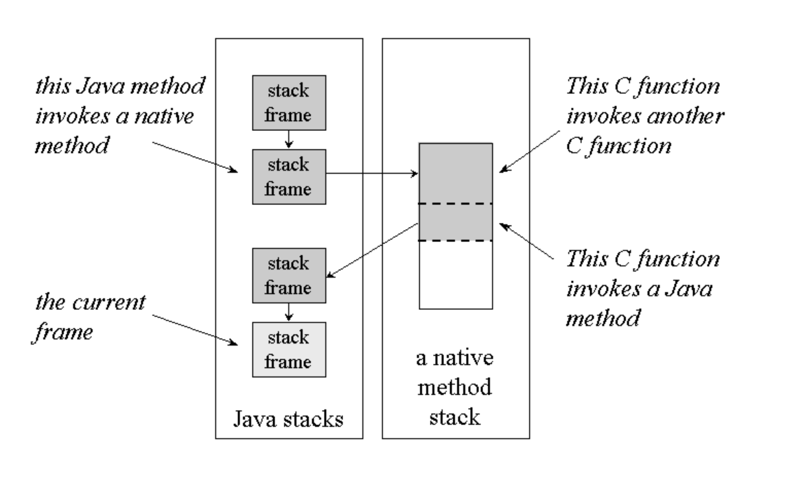

### Intro
`JVM(Java Virtual Machine)`은 자바 프로그램을 실행하는 환경입니다. 
Java로 작성된 코드는 javac로 컴파일되어 바이트 코드(bytecode)로 변환됩니다. 
이 바이트 코드가 JVM에서 실행됩니다. 
`JVM`이 운영체제와 프로그램 사이에서 중간자 역할을 하여 플랫폼 독립적인 실행 환경을 제공합니다.
`JVM`은 `GC(Garbage Collector)`, `Execution Engine`, `Class Loader`, `Runtime Data Area`로 구성되어있습니다. 
우선 바이트 코드가 `JVM` 어디에서 어떤 형태로 거주하고 있는지 알아봅시다.
# 

# 
### Runtime Data Area

JVM은 자바 프로그램을 실행하는 동안 필요한 데이터를 `PC Register`, `Native Method Stack`, `Java Stack`, `Method Area`, `Heap`의 영역으로 나눠 관리합니다.
`PC Register`, `Native Method Stack`, `Java Stack`은 스레드마다 생성되는 영역이며 `Method Area`, `Heap`은 모든 스레드가 함께 공유하는 영역입니다.

### PC Register(Program Counter Register)
JVM에서의 멀티스레딩은 CPU 코어를 여러 스레드가 교대로 사용하는 방식으로 구현되기 때문에
특정 시각에 각 코어는 한 스레드의 명령어만 실행하게 됩니다. 
그러므로 스레드 전환 후 이전에 실행하다 멈춘 지점으로 정확하게 복원하려면 스레드 각각에는 고유한 프로그램 카운터가 필요합니다.
# 
프로그램 카운터 레지스터는 작은 메모리 영역으로, 현재 실행 중인 스레드의 바이트코드 줄 번호을 저장합니다.
프로그램의 제어 흐름, 분기, 순환, 예외처리나 스레드 복원 같은 모든 기능이 프로그램 카운터를 통해서 이루어집니다.

### Java Stack
자바 스택(자바 가상 머신 스택) 또한 스레드마다 생성되며 스레드의 생명주기와 함께 합니다. 
스레드는 메서드가 호출될 때마다 스택 프레임을 만들어 지역 변수 테이블, 피연산자 스택, 메서드 반환값 등의 메서드와 관련된 정보를 저장합니다.
그리고 스택 프레임을 자바 스택에 push하고 메서드가 끝나면 pop하는 일을 반복합니다.

스택 프레임에 저장되는 지역 변수 테이블은 컴파일 타임에 알 수 있는 다양한 기본 데이터 타입, 객체 참조, 반환 주소 타입을 저장합니다.
지역 변수 테이블이 필요한 공간은 컴파일 과정에서 할당되며 지역 변수 슬롯은 일반적으로 32비트로 64비트인 double타입을 제외하고 1개의 슬롯에 저장됩니다.

### Native Method Stack

네이티브 메서드 스택은 자바 스택과 비슷한 역할을 합니다. 다른 점은 네이티브 메서드를 호출하는 부분입니다.
네이티브 메서드는 자바 프로그램의 일부로 작성되지 않은 코드로 보통 C나 C++와 같은 언어로 작성됩니다.
스레드가 메서드 내부에서 네이티브 메서드를 호출하게되면 네이티브 메서드에 동적으로 연결되어 네이티브 메서드가 호출됩니다.
자바 메서드가 확장된 것 처럼 생각할 수 있습니다. 호출된 네이티브 메서드는 자바 스택이 아닌 네이티브 메서드 스택에 push되어 처리됩니다.

### Heap
힙은 모든 스레드가 공유하는 영역으로 JVM이 구동될 때 만들어집니다. 
자바 프로그램이 사용할 수 있는 가장 큰 메모리이며 '거의 ' 모든 객체 인스턴스가 힙 영역에 할당됩니다.
힙은 GC(가비지 컬렉터)가 관리하는 메모리 영역으로 GC의 알고리즘에 따라 `new generation`, `old generation`,
`Permanent generation(JDK7)`, `eden space`, `survivor space` 영역으로 분류됩니다.
# 
JVM은 new 명령에 해당하는 바이트 코드를 만나면 새 객체를 담을 메모리를 힙에 할당합니다. 
객체에 필요한 메모리 크기는 클래스를 로딩할때 계산되어 클래스 메타데이터로 저장됩니다.
멀티 스레드 환경에서는 두 개의 스레드가 Heap 메모리에 같은 공간을 할당받는 동기화 문제를 생각해볼 수 있습니다.
그래서 JVM은 메모리를 스레드에 안전하게 할당하기 위하여 2가지 방법을 제공합니다.
# 
첫 번째는 CAS(Compare And Swap)알고리즘 입니다.  
두 번째는 스레드마다 다른 힙 메모리 공간을 할당하는 것입니다. 스레드 로컬 할당 버퍼(TLAB)라고 하며 
각 스레드는 로컬 버퍼에서 메모리를 할당받아 사용하다가 버퍼가 부족해지면 그때 동기화를 해 새로운 버퍼를
할당 받는 식으로 동작합니다. JVM이 스레드 로컬 할당 버퍼를 사용할지는 `-XX:+/-UseTLAB` 매개 변수로 설정합니다.
# 
힙 메모리가 할당된 다음 JVM은 객체에 필요한 정보를 설정합니다. 
해당 객체의 클래스의 메타정보는 어떻게 찾는지, 해당 객체의 해시코드는 무엇인지, GC 세대 나이는 얼마인지에 대한
객체 정보를 객체 헤더에 저장합니다. 이후 생성자 메서드가 호출되어 힙 메모리에 객체가 생성됩니다.

### Method Area
`메서드 영역`도 `힙`처럼 모든 스레드가 공유합니다. 
`메서드 영역`에는 `클래스 정보`, `상수(Runtime Constant Pool)`, `정적 변수`, `JIT 컴파일러`가 컴파일한 코드 캐시 등이 저장됩니다.
`메서드 영역` 또한 GC의 관리 대상입니다. 그러나 GC를 사용하지 않아도 될 정도로 영향은 미비합니다.
#
`메서드 영역`은 구현한 `JVM벤더`마다 달랐습니다.
`Oracle Hotspot`의 `JDK7`까지는 `메서드 영역`을 `힙`의 `PermGen`에 구현했습니다.
`PermGen`의 영역은 기본값으로 32-bit기준 64MB, 64-bit 기준으로 82MB으로 작은 영역이었기에 `GC(Garbage Collection)`가 자주 발생하였습니다.
그리고 `JVM`이 필요할 때 `PermGen`의 메모리를 확장하지 못하며 `JVM`의 옵션으로 `-XX:MaxPermSize`, `-XX:PermSize`로 고정된 값으로 변경할 수 있었습니다. 
이로 인해 `OOM(OutOfMemoryError)`이 자주 발생하기도 했으며 튜닝하기 어려운 포인트였습니다.
#
이러한 문제를 해결하기 위해 `Oracle Hotspot`의 `JDK8`에서는 `힙`의 `PermGen`이 사라지고 
`메서드 영역`을 `Heap`에서 분리한 `Metaspace`으로 대체했습니다. 
`Metaspcae`는 `PermGen`과 달리 OS의 네이티브 메모리를 사용하여 `JVM`에서 필요시 메모리를 확장할 수 있습니다.

### Runtime Constant Pool
런타임 상수 풀은 메서드 영역의 일부입니다. 
여기에는 클래스 파일에 포함된 설명 정보(클래스 버전, 필드, 메서드, 인터페이스 등)가 저장됩니다. 
JVM은 클래스를 로드할 때 이러한 정보를 메서드 영역의 런타임 상수 풀에 저장합니다.
# 
런타임 상수 풀에는 상수가 저장되며 동적으로 생성된 상수도 포함될 수 있습니다. 
예를 들어, `String::intern()` 메서드를 호출하여 새로운 상수를 생성하면 
이 상수는 힙 영역이 아닌 런타임 상수 풀에 저장됩니다.
# 
JDK 7 이전에는 메서드 영역이 PermGen(Permanent Generation)에 구현되었습니다. 
상수를 동적으로 생성하여 런타임 상수 풀에 저장할 때 
메모리를 초과하면 `OutOfMemoryError`가 발생했습니다. 
이는 PermGen이 고정 크기였기 때문에 발생하는 문제였습니다.
#
JDK 8부터는 PermGen이 사라지고 대신 Metaspace가 도입되었습니다. 
Metaspace는 네이티브 메모리를 사용하여 클래스 메타데이터를 저장합니다. 
이로 인해, 메모리 관리가 유연해지고 PermGen의 고정 크기 제한 문제가 해결되었습니다. 
따라서 동적 상수 생성 시 메모리 초과로 인한 문제가 줄어들었습니다.

### Reference
https://www.artima.com/insidejvm/ed2/jvm5.html